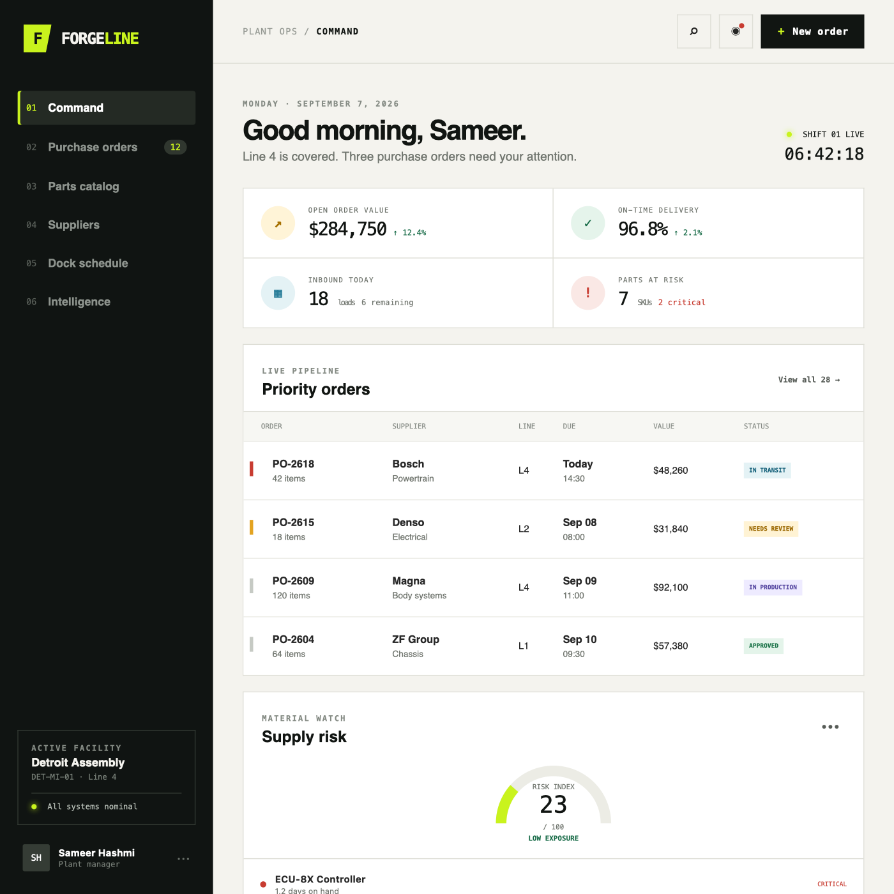
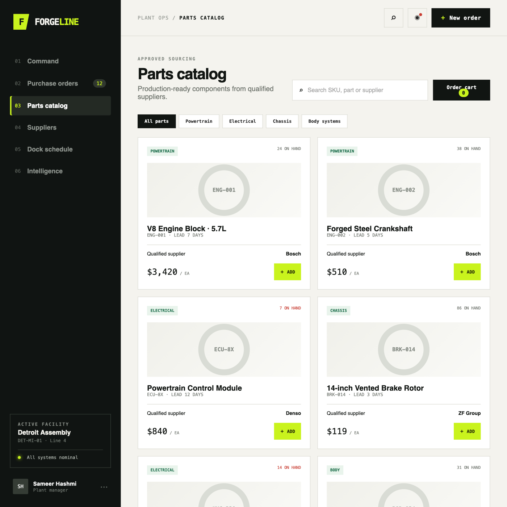

# ForgeLine

**The parts-ordering command center for automotive manufacturing plants.**

ForgeLine turns fragmented parts requests into structured purchase orders, controlled approvals, scheduled deliveries, and actionable supply-chain intelligence. It combines ordering, qualified suppliers, receiving, payments, inventory risk, analytics, notifications, and shareable procurement links in one focused workspace.

## Application Preview

### Plant Command Center

Live purchase orders, inbound loads, material risk, dock appointments, and operational activity in a single plant view.



### Qualified Parts Catalog

Search and filter approved production components, compare supplier lead times, monitor stock, and build an order from one catalog.



## Core Capabilities

- **Purchase order control:** Draft, approval, production, shipment, receiving, completion, hold, and cancellation workflows.
- **Automotive parts catalog:** OEM and manufacturer numbers, compatibility, serial tracking, hazardous-material flags, MOQs, lead times, and volume pricing.
- **Plant inventory:** On-hand, reserved, on-order, reorder-point, bin, lot, and serial-number visibility.
- **Supplier management:** Qualified plant suppliers, preferred status, lead times, minimum order values, and delivery performance.
- **Dock and delivery operations:** JIT scheduling, carriers, drivers, tracking, receiving, rejection quantities, and proof of delivery.
- **Payments:** Deposits, partial payments, net terms, outstanding balances, refunds, and Stripe payment intents.
- **Supply intelligence:** Order value, delivery performance, low-stock exposure, top parts, supplier spend, and order heat maps.
- **Conversation-to-order AI:** Extract parts, quantities, urgency, requester details, and due dates from incoming messages.
- **Shareable ordering links:** Restricted plant catalogs, QR codes, expiration and usage controls, validated tier pricing, and approval-ready submissions.
- **Role-based operations:** Admin, plant manager, procurement officer, supplier, and warehouse access.

## Product Demo

Open `frontend/index.html` directly in a browser. The responsive demo requires no build step.

Interactive flows:

- Navigate between plant operations modules.
- Open the approved parts catalog.
- Search and filter production components.
- Add parts, adjust quantities, and submit a purchase request.
- Review live order, dock, supply-risk, and activity data.

## Backend Setup

Requirements: Node.js 20+, npm, Docker.

```bash
docker compose up -d
cd backend
cp .env.example .env
npm install
npm run prisma:generate
npm run prisma:migrate -- --name initial
npm run prisma:seed
npm run dev
```

The API runs at `http://localhost:3001`; health check: `GET /health`.

## Architecture

| Layer | Technology |
| --- | --- |
| Frontend demo | HTML5, responsive CSS, vanilla JavaScript |
| API | Node.js, Express, TypeScript |
| Data | PostgreSQL, Prisma ORM |
| Authentication | JWT access and refresh tokens, HTTP-only cookies, role-based access |
| Realtime | Socket.IO |
| Integrations | Stripe, OpenAI, SendGrid, S3-compatible storage |
| Local infrastructure | Docker Compose |

Demo credentials after seeding:

- `admin@autoparts.com` / `password123`
- `procurement@autoparts.com` / `password123`
- `warehouse@autoparts.com` / `password123`

## Ordering-Link API

- `GET /api/public/order-links/:code` returns the restricted plant catalog.
- `POST /api/public/order-links/:code/orders` validates supplier access, MOQ limits, tier pricing, and creates a pending-approval order.
- Authenticated dashboard APIs cover orders, parts, plants, suppliers, customers, payments, deliveries, analytics, notifications, users, documents, AI extraction, and QR-enabled share links.

Optional integrations are configured in `backend/.env`: Stripe, SendGrid, OpenAI, Redis, and S3.

## Project Structure

```text
auto-parts-platform/
├── backend/
│   ├── prisma/          # Data model and seed data
│   └── src/             # API routes, middleware, and services
├── docs/screenshots/    # README product snapshots
├── frontend/            # Build-free interactive product demo
└── docker-compose.yml   # Local PostgreSQL service
```

## Security Notes

- Public order submissions calculate prices on the server rather than trusting browser totals.
- Ordering links enforce plant, supplier, part, MOQ, expiration, and usage restrictions.
- Passwords use bcrypt hashing; protected APIs enforce JWT authentication and role checks.
- Production deployments should replace demo credentials and all example secrets before use.
